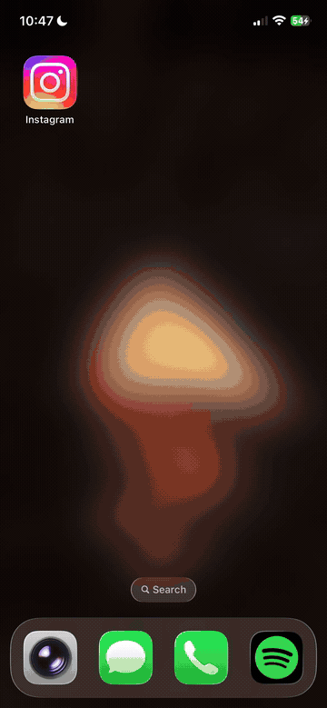
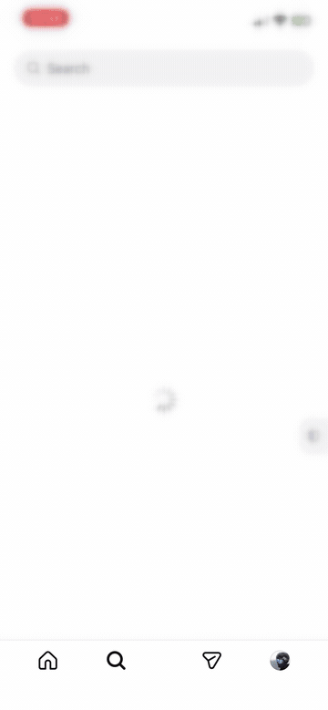
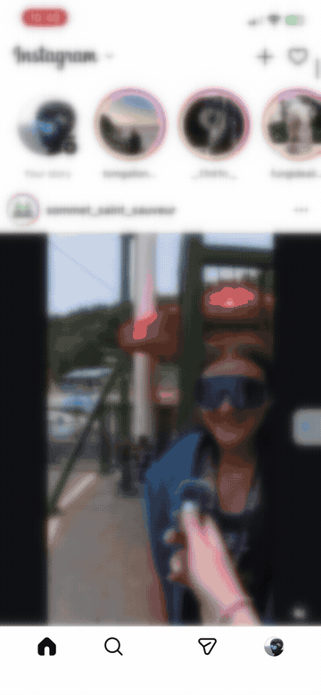
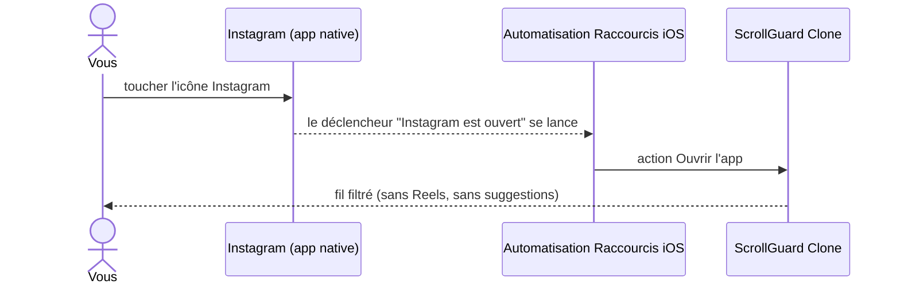

# ScrollGuard Clone

[English](README.md)

Une alternative gratuite à [ScrollGuard](https://scrollguard.app/) :
utiliser Instagram sans Reels, sans publications suggérées dans le fil et sans la grille
algorithmique de la page de recherche.

Conçu d'abord pour un usage personnel sur iOS, une version Android est prévue plus tard.

> **Avertissement.** Projet personnel et non commercial. Il n'est ni affilié à Instagram, à Meta
> ou à l'application ScrollGuard, ni approuvé ou soutenu par eux. Il fonctionne en exécutant un
> client web filtré sur le site mobile d'Instagram, à l'intérieur d'un `WKWebView` isolé. Il ne
> modifie pas, ne corrige pas et ne fait pas de rétroingénierie de l'application Instagram native.

## Démo

Enregistré sur l'appareil (iPhone, iOS 18). Trois fonctionnalités à voir :

<table>
<tr>
<td width="33%"></td>
<td width="33%"></td>
<td width="33%"></td>
</tr>
<tr>
<td valign="top"><b>1. La redirection</b><br>Toucher la vraie icône Instagram fait apparaître l'app native un instant, puis mène au client filtré. Regardez la barre du bas : quatre onglets, pas de Reels.</td>
<td valign="top"><b>2. La grille Explorer</b><br>La recherche s'ouvre vide. Désactiver <i>Hide the Explore grid</i> recharge la page et la grille algorithmique revient. La réactiver la vide de nouveau.</td>
<td valign="top"><b>3. L'onglet Reels</b><br>Même aller-retour pour <i>Hide the Reels tab</i>. Le cinquième bouton de navigation réapparaît et disparaît au fil de la réécriture du CSS injecté.</td>
</tr>
</table>

_Le contenu du fil est flouté par souci de confidentialité. L'interface de l'app elle-même est intacte._

Démonstration complète de 33 secondes : [docs/assets/scroll-guard-demo.mp4](docs/assets/scroll-guard-demo.mp4)

## Comment ça marche

L'isolation des applications sur iOS fait qu'aucune app ne peut modifier l'interface d'une autre.
Rien ne peut aller dans l'app Instagram native pour y cacher le bouton Reels. Alors, comme
ScrollGuard, cette app utilise un contournement en trois morceaux :

1. **Un client web Instagram filtré.** L'app est une mince coquille autour d'un `WKWebView` qui
   charge `instagram.com` (version mobile). Comme nous contrôlons la vue web, nous pouvons y
   injecter du CSS et du JS qui cachent l'onglet Reels, retirent les publications suggérées du
   fil d'accueil et vident la grille Explorer.
2. **Une automatisation Raccourcis d'Apple comme redirection.** Vous gardez la vraie app
   Instagram installée (les notifications et les messages privés continuent donc de fonctionner)
   et vous créez une automatisation Raccourcis : *« Quand Instagram s'ouvre, ouvrir ScrollGuard
   Clone. »* Instagram apparaît un instant, puis vous arrivez dans le client filtré. L'app
   enregistre le schéma d'URL `scrollguard://` pour que le raccourci puisse l'ouvrir.
3. **(Optionnel, plus tard) Un blocage par Temps d'écran** au moyen du cadriciel FamilyControls,
   pour bloquer fermement l'app native au lieu de dépendre de la redirection.

La redirection est la pièce qui rend le tout utilisable au quotidien. Instagram reste installé
pour les notifications et les messages privés, mais l'ouvrir vous renvoie directement dans le
client filtré :



D'autres diagrammes de séquence : le filtrage du contenu, les interrupteurs de réglages et le
lancement de l'app se trouvent dans [docs/ARCHITECTURE.md](docs/ARCHITECTURE.md).

## Stack technique

- **SwiftUI** pour toute l'interface native (réglages, écrans d'introduction, écran de
  démarrage). Aucun contrôleur de vue UIKit.
- **WebKit (`WKWebView`)** comme client Instagram filtré, piloté entièrement par
  `WKUserScript` et `WKNavigationDelegate`. Aucune API privée.
- **JS et CSS purs**, générés à partir des règles définies côté Swift et injectés à
  `document-start`, pour filtrer une application React monopage sans pouvoir compter sur une API
  d'extension de navigateur.
- **UserDefaults** pour le peu d'état local à conserver (interrupteurs de filtres, introduction
  terminée). Aucun serveur, aucune analytique, rien ne quitte l'appareil.
- **Raccourcis d'Apple** (au moyen du schéma d'URL `scrollguard://` et d'une automatisation
  « Ouvrir l'app ») comme mécanisme de redirection, ce qui contourne l'absence, sur iOS, d'une
  API permettant à une app de modifier l'interface d'une autre.

## Structure du dépôt

```
ScrollGuardClone.xcodeproj/   Projet Xcode (ouvrir celui-ci)
ScrollGuardClone/             Code source de l'app (SwiftUI + WebKit)
docs/ARCHITECTURE.md          Diagrammes de composants et de séquence, comment tout s'imbrique
docs/diagrams/                Sources PlantUML référencées par ARCHITECTURE.md
docs/assets/                  GIF de démo et enregistrement d'écran complet
docs/SETUP.md                 Comment compiler et lancer l'app sur votre iPhone
docs/TESTING.md               Liste de vérification d'une installation et des filtres
```

## Démarrage rapide

1. Ouvrez `ScrollGuardClone.xcodeproj` dans Xcode sur votre Mac.
2. Choisissez votre équipe personnelle sous *Signing & Capabilities* (un identifiant Apple
   gratuit suffit).
3. Branchez votre iPhone, choisissez-le comme destination d'exécution et appuyez sur **Run**.

Les instructions complètes, y compris les réglages de confiance au premier lancement sur le
téléphone, sont dans [docs/SETUP.md](docs/SETUP.md).

## Licence

MIT. Voyez le fichier [LICENSE](LICENSE). C'est un projet personnel, alors faites-en ce que
vous voulez.
