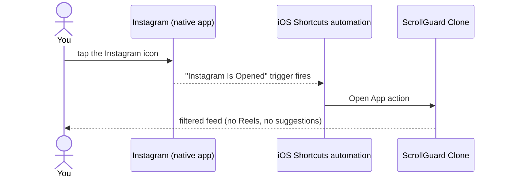

# ScrollGuard Clone

A free, self-built alternative to [ScrollGuard](https://scrollguard.app/): use Instagram without
Reels, without suggested posts in your feed, and without the algorithmic grid on the search page.

Built for personal use on iOS first, with an Android version planned later.

> **Disclaimer.** A personal, non-commercial project — not affiliated with, endorsed by, or
> connected to Instagram, Meta, or the ScrollGuard app. It works by running a filtered web client
> against Instagram's own mobile site inside a sandboxed `WKWebView`; it doesn't modify, patch, or
> reverse-engineer the native Instagram app itself.

## Demo

_TODO: screen recording / GIF once the redirect + filters have been demoed end-to-end._

## How it works

iOS sandboxing means no app can modify the UI of another app — nothing can reach inside the
native Instagram app and hide the Reels button. So, like ScrollGuard, this app uses a
three-piece workaround:

1. **A filtered Instagram web client.** The app is a thin shell around a `WKWebView` that loads
   `instagram.com` (mobile web). Because we control the web view, we can inject CSS/JS that
   hides the Reels tab, strips suggested posts from the home feed, and blanks the Explore grid.
2. **An Apple Shortcuts automation as the redirect.** You keep the real Instagram app installed
   (so notifications and DMs still work) and set up a Shortcuts automation:
   *"When Instagram opens → open ScrollGuard Clone."* Instagram flashes for a moment, then you
   land in the filtered client. The app registers the `scrollguard://` URL scheme so the
   shortcut can open it.
3. **(Optional, later) Screen Time shielding** via the FamilyControls framework to hard-block
   the native app instead of relying on the redirect.

The redirect is the piece that makes it usable day-to-day — Instagram stays installed for
notifications and DMs, but opening it bounces you straight into the filtered client instead:



More sequence diagrams — content filtering, settings toggles, app launch — are in
[docs/ARCHITECTURE.md](docs/ARCHITECTURE.md).

## Tech stack

- **SwiftUI** for all native chrome (settings, onboarding, splash) — no UIKit view controllers.
- **WebKit (`WKWebView`)** as the filtered Instagram client, driven entirely through
  `WKUserScript`/`WKNavigationDelegate` — no private APIs.
- **Vanilla JS + CSS**, generated from Swift-side rule data and injected at `document-start`, to
  filter a React SPA without a browser extension API to lean on.
- **UserDefaults** for the small amount of local state (filter toggles, onboarding completion) —
  no backend, no analytics, nothing leaves the device.
- **Apple Shortcuts** (via the `scrollguard://` URL scheme and an "Open App" automation) as the
  redirect mechanism, working around iOS's lack of an API for one app to modify another's UI.

## Repository layout

```
ScrollGuardClone.xcodeproj/   Xcode project (open this)
ScrollGuardClone/             App source (SwiftUI + WebKit)
docs/ARCHITECTURE.md          Component + sequence diagrams, how the pieces fit together
docs/diagrams/                PlantUML sources referenced by ARCHITECTURE.md
docs/PLAN.md                  Phased development plan and current status
docs/SETUP.md                 How to build and run on your iPhone
docs/MAC-CHECKLIST.md         What to do next time you're on the Mac
docs/DEVLOG.md                Running notes on what was built and why
```

## Quick start

1. Open `ScrollGuardClone.xcodeproj` in Xcode on your Mac.
2. Select your personal team under *Signing & Capabilities* (a free Apple ID works).
3. Plug in your iPhone, select it as the run destination, and hit **Run**.

Full instructions, including first-run trust settings on the phone, are in
[docs/SETUP.md](docs/SETUP.md).

## Status

Phases 0–3 (web shell, content filters, settings, redirect onboarding) are built and accepted
after on-device testing. Phase 4 (an optional Screen Time hard-block) is in progress; Phase 5
(TestFlight distribution + an Android sibling app) is planned. See
[docs/PLAN.md](docs/PLAN.md) for the full roadmap and acceptance criteria per phase.
