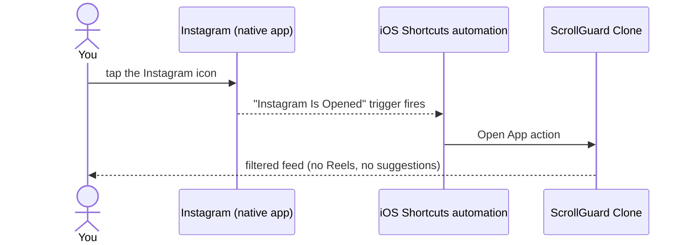

# ScrollGuard Clone

[Français](README.fr.md)

A free, self-built alternative to [ScrollGuard](https://scrollguard.app/): use Instagram without
Reels, without suggested posts in your feed, and without the algorithmic grid on the search page.

Built for personal use on iOS first, with an Android version planned later.

> **Disclaimer.** A personal, non-commercial project. Not affiliated with, endorsed by, or
> connected to Instagram, Meta, or the ScrollGuard app. It works by running a filtered web client
> against Instagram's own mobile site inside a sandboxed `WKWebView`; it doesn't modify, patch, or
> reverse-engineer the native Instagram app itself.

## Demo

Recorded on-device (iPhone, iOS 18). Three things worth seeing:

<table>
<tr>
<td width="33%"></td>
<td width="33%"></td>
<td width="33%"></td>
</tr>
<tr>
<td valign="top"><b>1. The redirect</b><br>Tapping the real Instagram icon flashes the native app for a moment, then lands in the filtered client. Note the bottom bar: four tabs, no Reels.</td>
<td valign="top"><b>2. The Explore grid</b><br>Search opens blank. Turning <i>Hide the Explore grid</i> off reloads the page and the algorithmic grid comes back; turning it on blanks it again.</td>
<td valign="top"><b>3. The Reels tab</b><br>Same round trip for <i>Hide the Reels tab</i>. The fifth nav button reappears and disappears as the injected CSS is rewritten.</td>
</tr>
</table>

_Feed content is blurred for privacy; the app's own UI is untouched._

Full 33-second walkthrough: [docs/assets/scroll-guard-demo.mp4](docs/assets/scroll-guard-demo.mp4)

## How it works

iOS sandboxing means no app can modify the UI of another app. Nothing can reach inside the
native Instagram app and hide the Reels button. So, like ScrollGuard, this app uses a
three-piece workaround:

1. **A filtered Instagram web client.** The app is a thin shell around a `WKWebView` that loads
   `instagram.com` (mobile web). Because we control the web view, we can inject CSS/JS that
   hides the Reels tab, strips suggested posts from the home feed, and blanks the Explore grid.
2. **An Apple Shortcuts automation as the redirect.** You keep the real Instagram app installed
   (so notifications and DMs still work) and set up a Shortcuts automation:
   *"When Instagram opens → open ScrollGuard Clone."* Instagram flashes for a moment, then you
   land in the filtered client. The app registers the `scrollguard://` URL scheme so the
   shortcut can open it.
3. **(Optional, later) Screen Time shielding** via the FamilyControls framework to hard-block
   the native app instead of relying on the redirect.

The redirect is the piece that makes it usable day-to-day. Instagram stays installed for
notifications and DMs, but opening it bounces you straight into the filtered client instead:


```mermaid
sequenceDiagram
    actor You
    participant Instagram as Instagram (native app)
    participant Shortcuts as iOS Shortcuts automation
    participant App as ScrollGuard Clone

    You->>Instagram: tap the Instagram icon
    Instagram-->>Shortcuts: "Instagram Is Opened" trigger fires
    Shortcuts->>App: Open App action
    App-->>You: filtered feed (no Reels, no suggestions)
```

More sequence diagrams for content filtering, settings toggles and app launch are in
[docs/ARCHITECTURE.md](docs/ARCHITECTURE.md).

## Tech stack

- **SwiftUI** for all native chrome (settings, onboarding, splash). No UIKit view controllers.
- **WebKit (`WKWebView`)** as the filtered Instagram client, driven entirely through
  `WKUserScript`/`WKNavigationDelegate`. No private APIs.
- **Vanilla JS + CSS**, generated from Swift-side rule data and injected at `document-start`, to
  filter a React SPA without a browser extension API to lean on.
- **UserDefaults** for the small amount of local state (filter toggles, onboarding completion).
  No backend, no analytics, nothing leaves the device.
- **Apple Shortcuts** (via the `scrollguard://` URL scheme and an "Open App" automation) as the
  redirect mechanism, working around iOS's lack of an API for one app to modify another's UI.

## Repository layout

```
ScrollGuardClone.xcodeproj/   Xcode project (open this)
ScrollGuardClone/             App source (SwiftUI + WebKit)
docs/ARCHITECTURE.md          Component + sequence diagrams, how the pieces fit together
docs/diagrams/                PlantUML sources referenced by ARCHITECTURE.md
docs/assets/                  Demo GIFs and the full screen recording
docs/SETUP.md                 How to build and run on your iPhone
docs/TESTING.md               Checklist for verifying a build and fixing filter drift
```

## Quick start

1. Open `ScrollGuardClone.xcodeproj` in Xcode on your Mac.
2. Select your personal team under *Signing & Capabilities* (a free Apple ID works).
3. Plug in your iPhone, select it as the run destination, and hit **Run**.

Full instructions, including first-run trust settings on the phone, are in
[docs/SETUP.md](docs/SETUP.md).

## License

MIT. See [LICENSE](LICENSE). It is a personal project, so do whatever you like with it.
